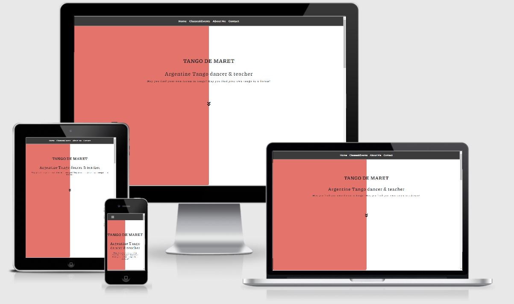
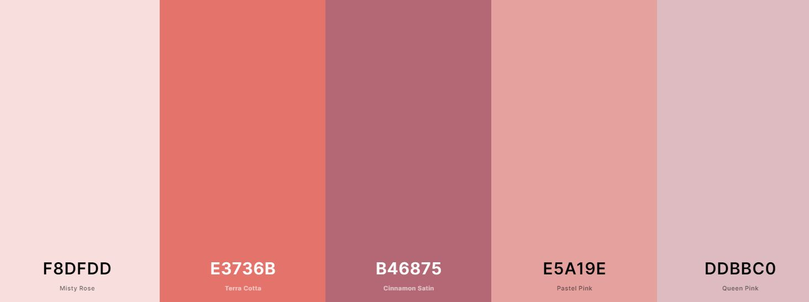

# Tango de Maret 

## Milestone Project 1 

"Tango de Maret" is an Argetinean tango dancer's professional website. It is the first Milestone Project using HTML, CSS and a framework, created for the "User Centric Frontend" module of the FullStack Software Development Course offered by Code Institute.

### Open links with ctrl + click

## UX 

The purpose of the site is to provide simple, fast-loading and  easy to use format evoking interest in users to join a tango class. 

### User Stories: 

* As a user I can get inspired by what emotions tango evokes, who is Maret and get a brief over-view of the history of Argentinean tango.
* As a user I can find information about when and where tango classes take place and where tango parties are organised with additional references to the organisation's social media pages.
* As a user I can get convinced why learn to tango with Maret.
* As a user I can contact Maret.

## Features 

* A fixed header - navigation between 4 pages.
* Home - has an introduction to tango, introduction to Maret's dream about tango and a brief over-view of the history of the dance.
* Classes & Events - an overview of where and when do classes and events take place.
* About Me - a biography of Maret.
* Contact - a contact form. 
* Footer - simple copyright footer.

## Feature/Design/UX Elements Left to Implement 

* Maret's Stories - a page with Maret's short stories and aphorisms. She writes inspiring texts.
* Replace the text of Classes & Events into calendars so that users can add them into their own calendars to be more UX friendly.
* Instead of one of the color-columns on index.html, I would like to add an Argentinean tango video with dancers, using the color layer as an overlay.

## Technologies Used

* [HTML, or Hyper Text Markup Language](https://developer.mozilla.org/en-US/docs/Web/HTML): Used to construct all the pages of this web site.

* [CSS, or Cascading Style Sheets](https://www.w3.org/Style/CSS/Overview.en.html): Is used to style various elements on a web page via coloring, spacing etc.

* [Bootstrap 4](https://getbootstrap.com/): A CSS framework that assists the programmer in creating responsive, mobile first front-end web sites.

* [Gitpod](https://www.gitpod.io/): An online IDE also used for creating & saving code that runs in a browser.

* [Git](https://git-scm.com/): A version control system for tracking changes in source code during software development.

* [GitHub](https://github.com): A company that provides hosting for software development version control using Git.

* [Chrome DevTools](https://developers.google.com/web/tools/chrome-devtools): A set of web developer tools built directly into the Google Chrome browser.

## Design

A standard layout is fully responsive on mobile devices and larger screens.

[Original wireframe](assets/photos/wireframe1.JPG)
[Original wireframe](assets/photos/wireframe2.JPG)

### Libraries & Credits

* [W3schools.com](https://www.w3schools.com/): General knowledge.
* [CommonMark.org](https://commonmark.org/help/): Common markdown cheat-sheet.
* [FontAwesome](https://fontawesome.com/): for social media icons.
* [Google fonts](https://fonts.google.com/): "Piazzolla" (body) & "Montserrat" (navigation bar).
* [Coolors.co](https://coolors.co/): generating colors in the same palette:
  
* Unsplash for photos: photographer- Toufic Mobarak- https://unsplash.com/photos/Kx2IgM3Q5jA; photographer- Axel Eres-  https://unsplash.com/photos/5K0U0Gc5Nmk;
* [Quote](https://psychologytomorrowmagazine.com/tango-a-feeling-that-is-danced/): Quote about Argentinean tango on HOME page.
* [Brief](https://www.adventuresindance.com/2016/01/timeline-for-the-history-of-tango-dance/): brief-history of Argentinean tango on HOME page.
* [Am I Responsive](http://ami.responsivedesign.is/): Mock-up image.
* Portraits are the property of Maret Laanes.

## Project barriers and solutions

* The resonsiveness of all the different sized text/color/photo section-divisions was a challenge. The text was cut/hidden on smaller resolutions. Therefore I manually set each sections' minimum-height.
* "Why Tango?" image "portrait-of-Maret" the purpose of the photo diminishes on the Ipad resolutions- working on cutting the photo, so that the face would still be visible.

## Testing

* [W3C Markup Validation Service](https://validator.w3.org/): to test HTML code - no errors.
* [W3C Markup Validator for CSS](https://jigsaw.w3.org/css-validator/validator): to test CSS code - no errors.
* [WebDev](https://web.dev/): service used to run the site's URL - ...

## Deployment

1. All of the code was written in GitPod to a GitHub repository.
2. Under the Settings section of the GitHub, scrolled down to GitHub Pages section.
3. Under the Source drop-down, the Master branch was selected.
4. Once selected, this publishes the project to GitHub Pages and displays the site's URL.
5. There is no difference between the deployed version and the development version.
6. The code can be run locally through clone or download.
7. You can do this by opening the repository, clicking on the green Code button and selecting either 'clone or download'.
8. The Clone option provides a URL, which you can use on your desktop IDE.
9. The Download ZIP option provides a link to download a ZIP file which can be unzipped on your local machine.

## Acknowledgements

1. Code Institute tutors and my mentor Adegbenga Adeye for guiding me to the right track. 
2. Code Institute Slack community for all their patience in beginners questions.
3. Maret Laanes for providing me with all the necessary information, inspiration and photo material.
