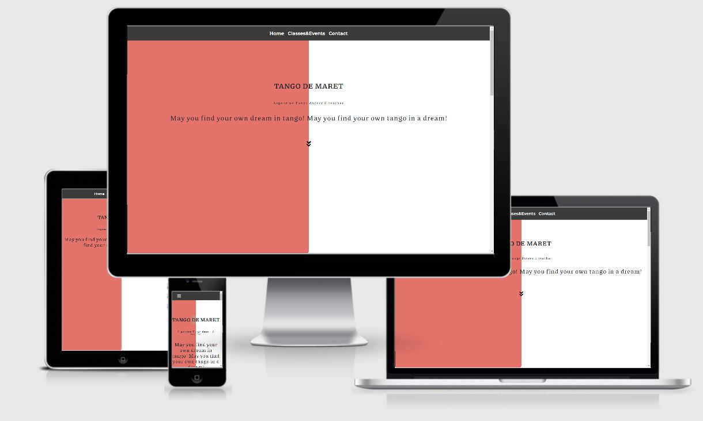

# Tango de Maret #

## Milestone Project 1 ##

"Tango de Maret" is an Argetinean tango dancer's professional website. It is the first Milestone Project created for the "User Centric Frontend" module of my FullStack Software Development Course offered by Code Institute.

## UX ##

The purpose of the site is to provide simple, easy to use format evoking interest in users to join a tango class. 

### User Stories: ###

* As a user I can get inspired by what emotions tango evokes, who is Maret and get a brief over-view of the history of Argentinean tango.
* As a user I can find information about when and where tango classes take place and where tango parties are organised with additional references to the organisation's social media pages.
* As a user I can get convinced why learn to tango with Maret.
* As a user I can contact Maret.

## Features ##

* Home - has an introduction to tango, introduction to Maret's dream about tango and a brief over-view of the history of the dance.
* Classes & Events - an overview of where and when do classes and events take place.
* About Me - a small biography of Maret.
* Contact - a contact form. 

## Feature/Design/UX Elements Left to Implement ## 

* Maret's Stories - a page with Maret's short stories and aphorisms. She can write inspiring texts.
* Replace the text of Classes & Events into calendars so that users can add them into their own calendars to be more UX friendly.
* To make the page more inviting to tango add a video with with tango tango dancers dancing to tango music, creating atmosphere- as music is the most imporant element. I don't have a video with copyright at the moment. 

## Technologies Used ##

* HTML, or Hyper Text Markup Language: Used to construct all the pages of this web site; https://developer.mozilla.org/en-US/docs/Web/HTML

* CSS, or Cascading Style Sheets: Is used to style various elements on a web page via coloring, spacing etc. ; https://www.w3.org/Style/CSS/Overview.en.html

* Bootstrap 4: A CSS framework that assists the programmer in creating responsive, mobile first front-end web sites; https://getbootstrap.com/

* Gitpod: An online IDE also used for creating & saving code that runs in a browser; https://www.gitpod.io/

* Git: A version control system for tracking changes in source code during software development;  https://git-scm.com/

* GitHub: A company that provides hosting for software development version control using Git; https://github

* Chrome DevTools: A set of web developer tools built directly into the Google Chrome browser; https://developers.google.com/web/tools/chrome-devtools

## Design ##

A standard layout is fully responsive on mobile devices and larger screens.

### Libraries & Credits ###

* FontAwesome for social media icons; https://fontawesome.com/
* Google fonts: "Piazzolla" (body) & "Montserrat" (navigation bar); https://fonts.google.com/
* Coolors.co generating colors in the same palette; https://coolors.co/
* Unsplash for photos; https://unsplash.com/photos/Kx2IgM3Q5jA

## Testing ##

* W3C Markup Validation Service Used to run all html and css code thru a validation process looking for errors; https://validator.w3.org/ https://jigsaw.w3.org/css-validator/validator; no errors

* WebDev service used to run the site's URL to test it in all aspects; https://web.dev/; 

## Acknowledgements ##

1. Code Institute tutors and my mentor Adegbenga Adeye for guiding me to the right track. 
2. Code Institute Slack community for all their patience in beginners questions.
3. Maret Laanes for providing me with all the necessary information and inspiration.
